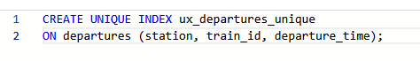
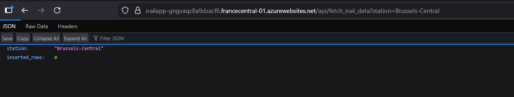
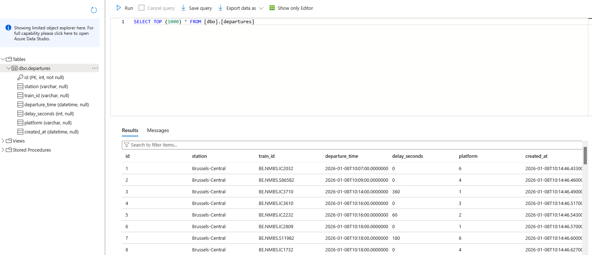

# 🚆 Azure Train Data Pipeline — iRail API

## Overview

This project implements an automated data pipeline that collects **live Belgian train departure data** from the iRail API, processes it using **Azure Functions**, and stores it in an **Azure SQL Database** for analysis and visualization with **Power BI**.

## Azure Services Used

- **Azure Function App (Python)** — serverless data ingestion

- **Azure SQL Database** — persistent storage

- **Azure Application Insights** — logging & monitoring

- **Power BI** — interactive dashboard

## Stations Collected

The pipeline automatically collects live departure data **every 5 minutes** for:

- Brugge

- Brussels-Central

- Gent-Sint-Pieters

- Antwerpen-Centraal

Stations can be selected dynamically using slicers in **Power BI**.

## Data Model

Table: `departures`

- station

- train_id

- departure_time

- delay_seconds

- platform

- created_at

A **UNIQUE index** on (station, train_id, departure_time) prevents duplicate records and ensures data quality.

## Automation

- Data ingestion runs **automatically every 5 minutes** using a Timer Trigger

- New departures are inserted; duplicates are ignored

- The system is fully serverless and requires no manual execution

## Visualization

The Azure SQL database is connected to **Power BI**, enabling:

- Station-based filtering

- Delay analysis

- Peak-hour insights

- Real-time dashboard updates as data accumulates

## Data Notes

- Data is collected **in real time** from deployment onward

- Historical backfill is not available via the iRail API

- The dataset grows continuously as the pipeline runs

## Submission Checklist

- [✅] GitHub repo with all source code and README
- [✅] Screenshot of Function App test run

- [✅] Screenshot of SQL data table

- [✅] If applicable, link to Power BI dashboard
- [❌] (Optional) CI/CD pipeline config and diagram

##  Acknowledgments

This project was created during the AI Bootcamp at __BeCode.org.__  
Feel free to reach out or connect with me on [LinkedIn](https://www.linkedin.com/in/brigi-bodi/)!

---